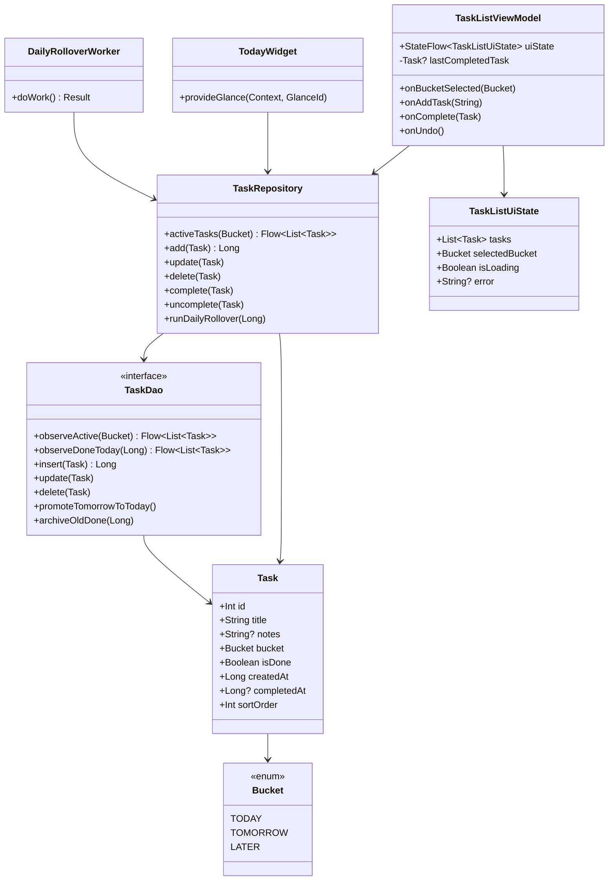
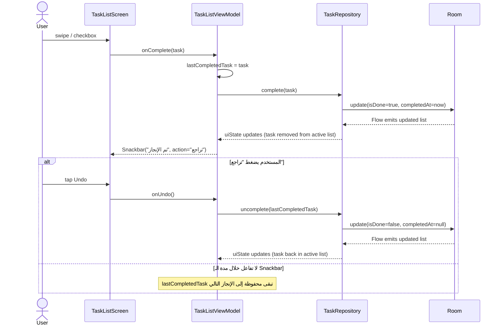

# Today — Focus Widget Task App

تطبيق مهام **offline-first محوره الـ Widget** — بدلاً من قائمة مزدحمة، الودجت
يعرض **أهم مهمة الآن** فقط + عدّاد "+N more" للباقي. Kotlin · Jetpack Compose ·
Jetpack Glance · Room · WorkManager · MVVM.

> قطعة محفظة للفريلانس، وأساس لمشروع تخرج (v2 — Context Engine، انظر §7).

---

## 1. Product Brief

**Value Proposition:**
مش قائمة مهام على شاشتك — **مهمتك الأهم الآن** على شاشتك. الودجت يعرض مهمة
واحدة (Focus) + عدّاد للباقي، بدون ما تفتح التطبيق أصلاً.

**Target Customer:**
الناس اللي بيهجروا تطبيقات المهام بعد أيام بسبب الاحتكاك (فتح التطبيق كخطوة
إضافية بتنكسر منها العادة)، واللي بيتوتّروا من قوائم الثلاثين مهمة.

**The Opportunity:**
أغلب تطبيقات المهام بتعامل الـ widget كإضافة ثانوية باهتة، واللي بيعملوا
widgets بيحشوها بقوائم مزدحمة. الفجوة: تطبيق **محوره الـ widget من الأساس**
يعرض **التركيز الحالي فقط**.

**Feasibility:**
تقنياً بالكامل بأدوات مجانية (Glance + Room + WorkManager)، بدون أي API
مدفوع أو سيرفر — يشتغل offline 100%.

**Business Model (تفكير مستقبلي، غير مطبَّق بـ v1):**
v1 مجاني بالكامل. لاحقاً Freemium ممكن: النواة مجانية، ميزات متقدمة (themes،
widgets متعددة، Context Engine بـ v2) مدفوعة.

---

## 2. المعمارية (Architecture)

```
┌─────────────┐      ┌──────────────┐      ┌─────────────┐
│   UI Layer  │◀────▶│  ViewModel   │◀────▶│ Repository  │
│ Compose +   │ Flow │ (UiState +   │      │ (single     │
│ Glance      │      │  events)     │      │  source of  │
└─────────────┘      └──────────────┘      │  truth)     │
       ▲                     ▲              └──────┬──────┘
       │                     │                     │
  Focus Widget      SavedStateHandle          ┌────▼────┐
  (Glance)          (selected bucket)         │  Room   │
                                               └────┬────┘
                                                    │
                                          ┌─────────▼─────────┐
                                          │ DailyRolloverWorker│
                                          │   (WorkManager)    │
                                          └────────────────────┘
```

- **UI** لا تعرف عن Room شيئاً — تتحدث مع الـ ViewModel فقط.
- **Repository (`TaskRepository`)** هو المصدر الوحيد للحقيقة — التطبيق
  والودجت الاثنان يقرآن منه، والودجت يُحدَّث يدوياً بعد كل تعديل بدل الاعتماد
  على استطلاع دوري (`updatePeriodMillis = 0`).
- **Room** طبقة التخزين الوحيدة (`Bucket`, `Task`, `TaskDao`, `AppDatabase`).

### خريطة الأنماط (Patterns Map)

| النمط | وين | ليش |
|---|---|---|
| MVVM | البنية الكلية | فصل الواجهة عن المنطق |
| Repository | بين ViewModel و Room | مصدر حقيقة واحد للتطبيق + الودجت |
| Observer | `Flow<List<Task>>` من Room → UI + Widget | تفاعل تلقائي مع تغيّر البيانات |
| Singleton | `AppDatabase.get()` | نسخة DB واحدة بكل التطبيق |
| Dependency Injection | حقن يدوي لـ `TaskRepository` في ViewModels والـ Worker | بدون Hilt — لا حاجة فعلية له بهذا الحجم |
| Undo بسيط | متغيّر `lastCompletedTask` بالـ ViewModel + Snackbar | يحل المشكلة الفعلية (تراجع عن آخر شطب) بأبسط حل |

> **قرار موثّق:** الـ Undo هنا متغيّر بسيط وليس Command/Memento pattern، لأن
> الحاجة الفعلية (تراجع خطوة واحدة) لا تبرر النمط الكامل. لو احتجنا لاحقاً
> undo متعدد الخطوات، الترقية لـ Command موثّقة كمسار تطوّر واعٍ — لا
> over-engineering قبل الحاجة الفعلية.

---

## 3. مخططات UML

### Class Diagram



### Sequence Diagram — إنجاز مهمة مع Undo



---

## 4. بنية المشروع

```
app/src/main/java/com/n/alian/today/
├── TodayApp.kt                        # Application + Configuration.Provider (WorkManager)
├── MainActivity.kt
├── data/
│   ├── local/        Bucket, Task, Converters, TaskDao, AppDatabase
│   └── repository/   TaskRepository (المصدر الوحيد للحقيقة)
├── ui/
│   ├── theme/         Color, Spacing, Type, Theme
│   └── tasklist/      TaskListScreen, TaskListViewModel, TaskListUiState, BucketLabel
├── widget/            TodayWidget, TodayWidgetReceiver, WidgetActions
└── worker/            DailyRolloverWorker, TodayWorkerFactory, RolloverScheduler
```

> ملاحظة تسمية: `namespace`/`applicationId` بالـ Gradle هو `com.nedal.today`،
> بينما كل كود Kotlin تحت حزمة `com.n.alian.today` — هذا موجود منذ أسبوع ١
> ويعمل بشكل صحيح (الفرق بين اسم الحزمة المصرَّح بها بـ Gradle وحزمة الكود
> لا يكسر شيئاً، فقط يعني أن صنف `R` المُولَّد يُستورد من `com.nedal.today.R`).

---

## 5. الإعداد والتشغيل

```bash
./gradlew assembleDebug          # بناء APK
./gradlew testDebugUnitTest      # اختبارات ViewModel (JVM)
./gradlew connectedDebugAndroidTest   # اختبار TaskDao (يحتاج جهاز/محاكي)
```

**لإضافة الودجت:** بعد تثبيت التطبيق، اضغط مطولاً على الشاشة الرئيسية ←
Widgets ← Today ← أضِف الودجت.

> ⚠️ لم يتيسّر أخذ screenshots/GIF فعلية لهذا الملف: الجلسة التي أنجزت هذا
> العمل كانت في بيئة سحابية بدون Android SDK/محاكي. مطلوب منك إرفاقها يدوياً
> بعد فتح المشروع في Android Studio وتشغيله فعلياً.

---

## 6. معايير الكود المتّبعة

- Kotlin idiomatic، أسماء واضحة بالإنجليزية.
- `data class` واحد للـ UI State لكل شاشة (`TaskListUiState`).
- كل قيم التصميم (لون/مسافة/خط) من `ui/theme/` فقط — ممنوع hardcoded.
- كل نص ظاهر للمستخدم من `strings.xml` (إنجليزي افتراضي) و `values-ar` (عربي).
- Conventional Commits: `feat(...)`/`fix(...)`/`refactor(...)`/`docs(...)`/`test(...)`.
- لا over-engineering: لا DI framework لعامل حقن واحد، لا Command pattern
  لـ undo بخطوة واحدة، لا LocalDataSource إضافي فوق Room.

---

## 7. خارطة v1.1 وما بعدها

- شاشة "المهام المنجزة اليوم" (`TaskDao.observeDoneToday` موجود وغير
  مستخدَم بأي شاشة بعد).
- سحب لليسار لحذف سريع، إضافة لسحب اليمين الحالي للإنجاز.
- إشعار تذكير اختياري لمهام TODAY لم تُنجز بحلول ساعة معينة.
- ترتيب المهام يدوياً (drag to reorder) بالاستفادة من `Task.sortOrder`
  الموجود أصلاً وغير مُستخدَم فعلياً بعد.
- **Morning Summary**: إشعار صباحي بعدد مهام اليوم وإنجاز الأمس.
- **Daily Streak**: عدّاد أيام متتالية أنجزت فيها مهمة.
- **Weekly Insights**: شاشة إحصائيات محلية من Room.

**v2 (مشروع تخرج):** Context Engine — Geofencing + Calendar + Energy Level
(مستوى طاقة لكل مهمة) لاقتراح المهمة المناسبة تلقائياً حسب المكان/الوقت،
عبر محرك قواعد محلي بسيط (`IF context THEN action`) — هنا الـ State pattern
يستحق مكانه فعلاً، بعكس v1.
